# Basic Probability

## 1
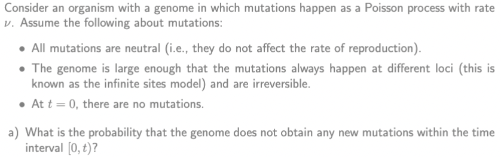

b) What is the expected number of mutations for time T?

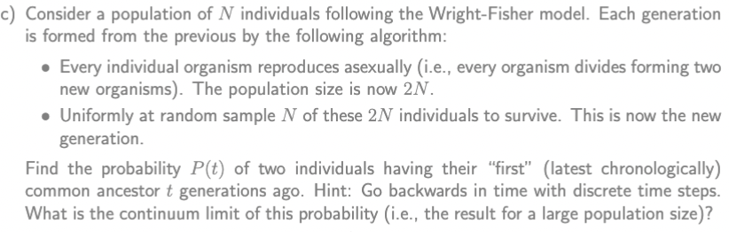
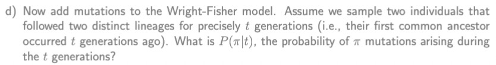
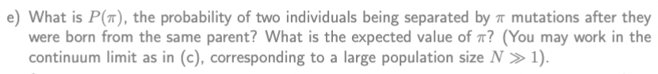

## 2

## 3
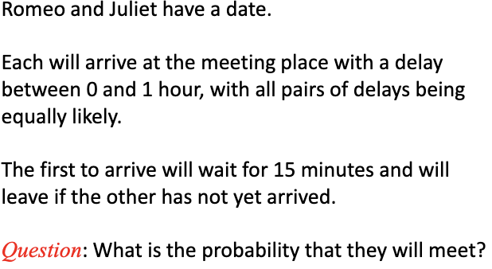

## 4
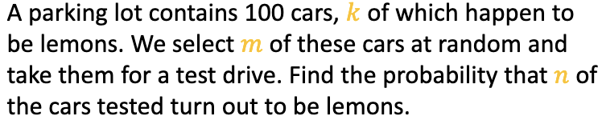

## 5
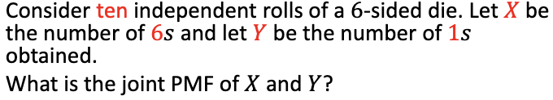

## 6
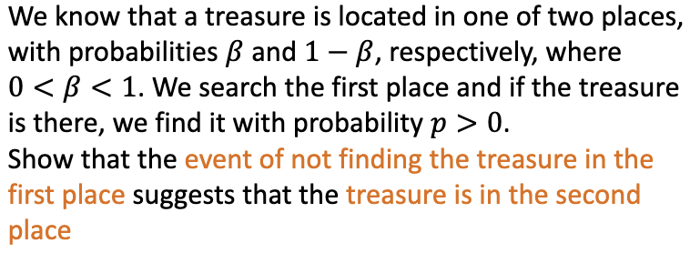

## 7
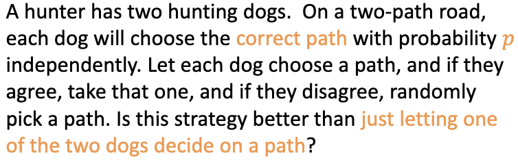

## 8
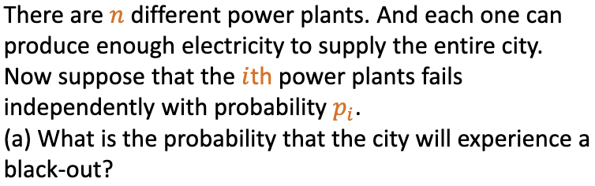

# Master Equations and Chapman-Kolmogorov

## 9
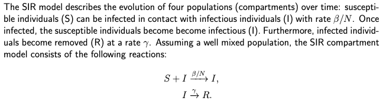
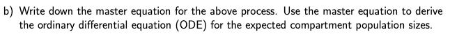

## 10
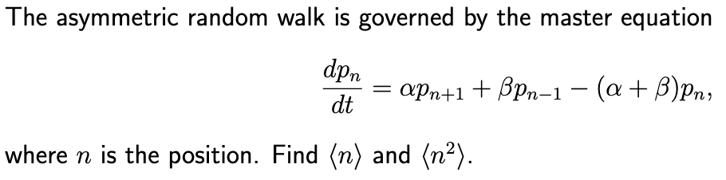

## 11
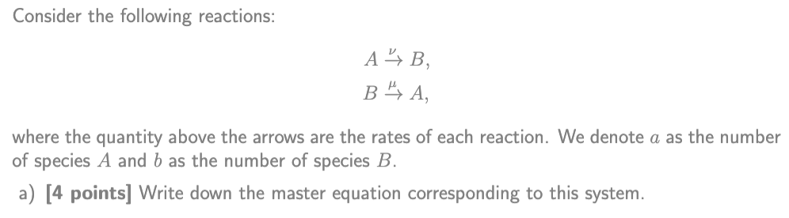
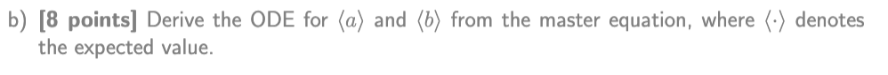

## 12
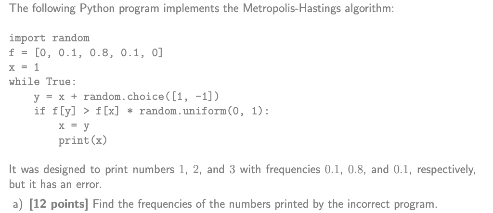

## 13
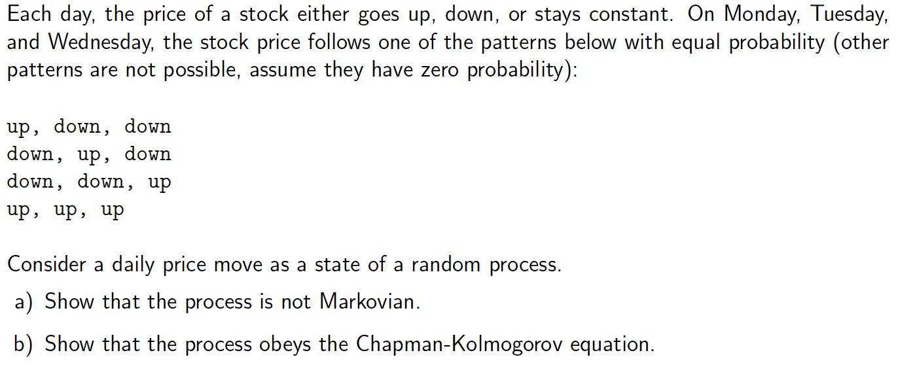

## 14
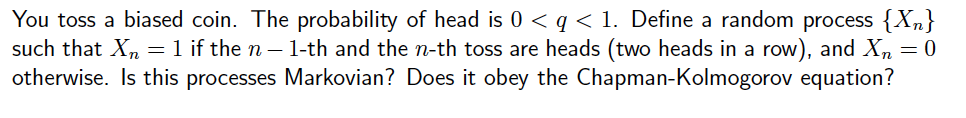

## 15
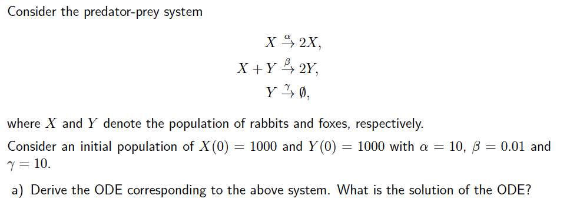

# Bayesian Inference

## 16
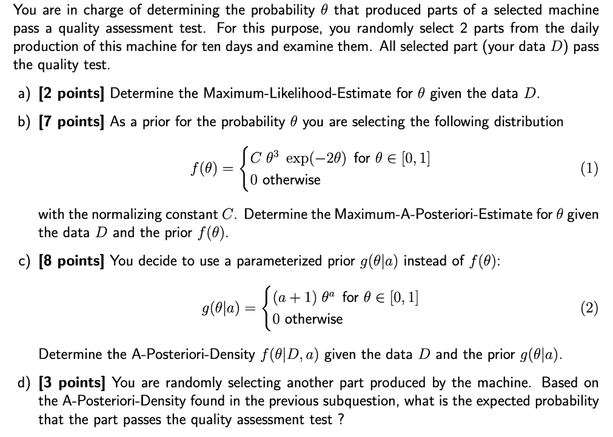

## 17
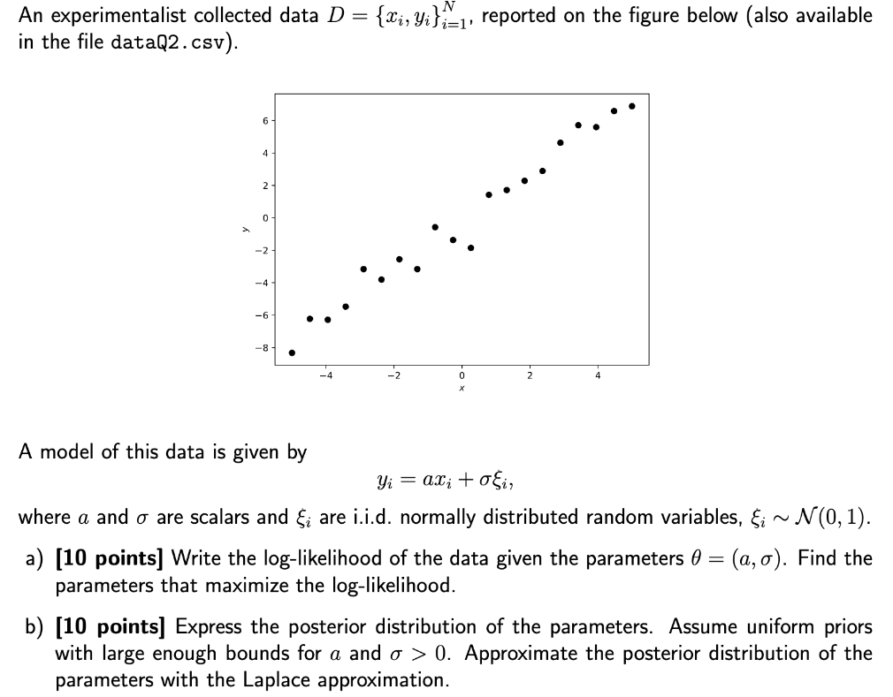

## 18
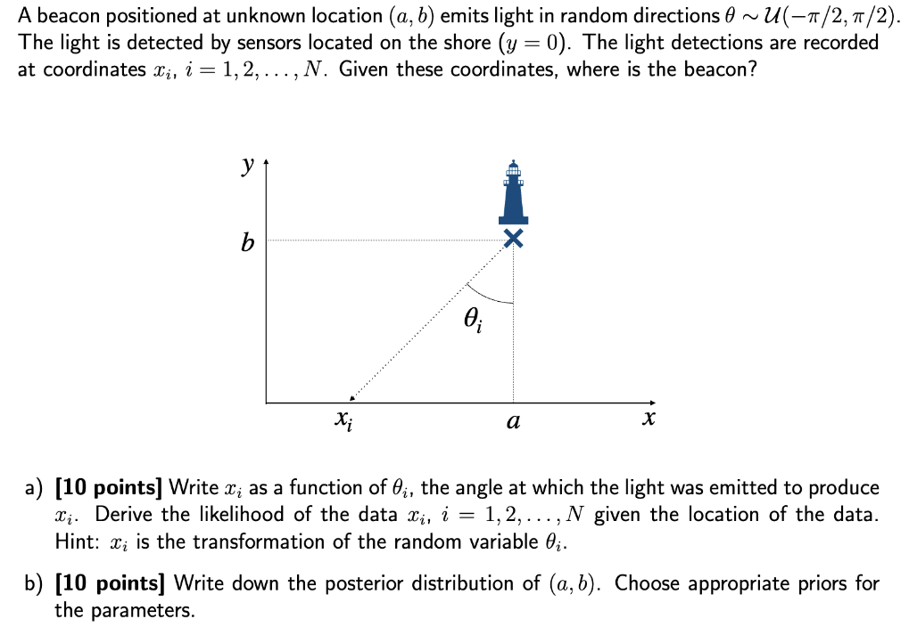

## 19
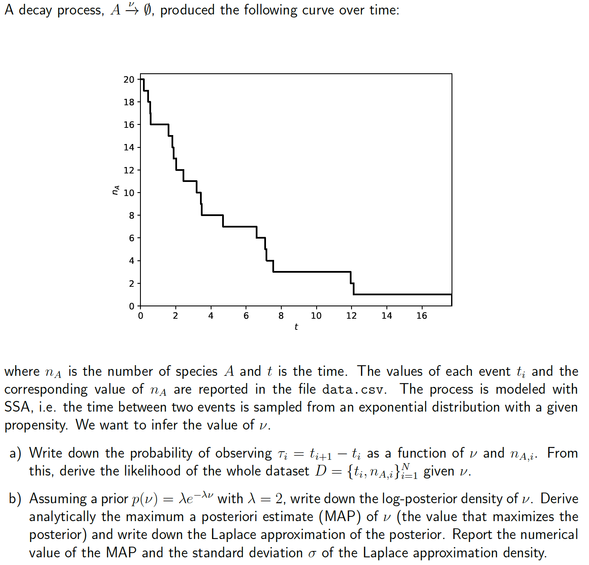

## 20
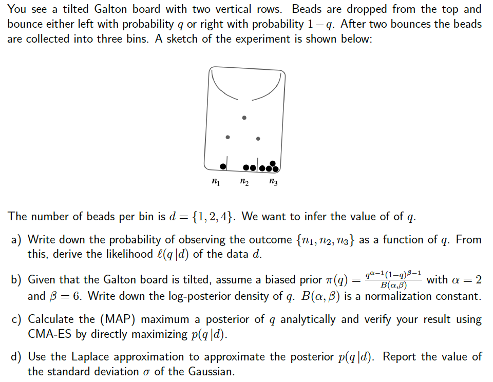

## 21
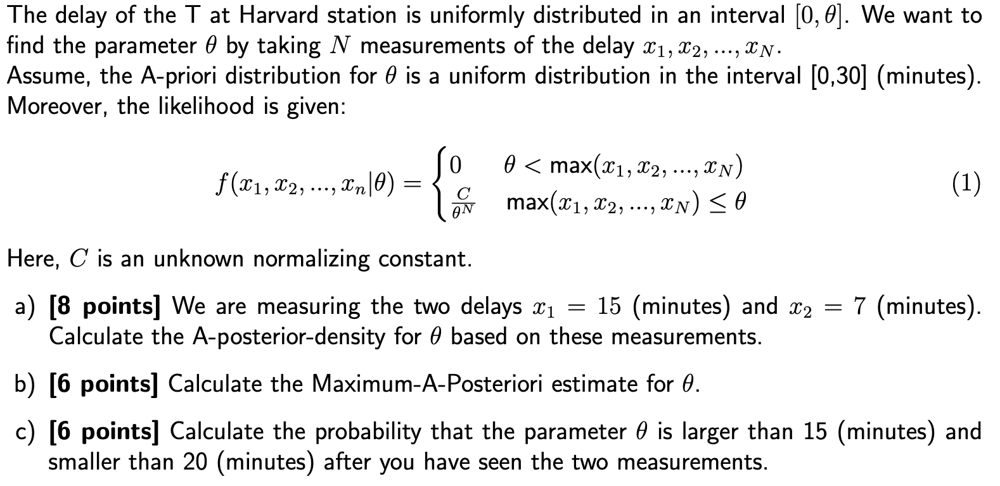