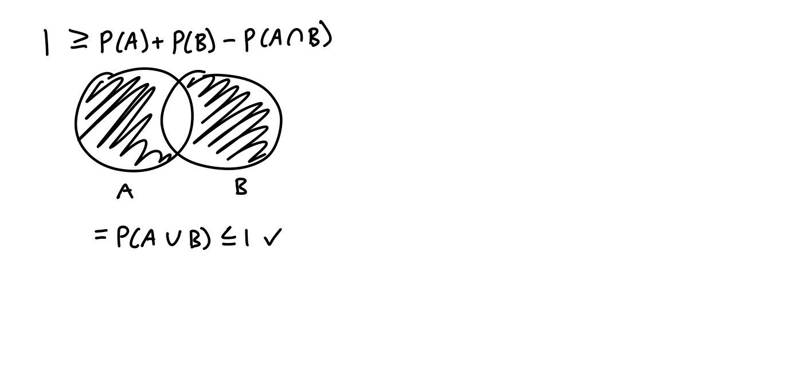

# Basic Probability

## 1

b) What is the expected number of mutations for time T?

## 2

## 3

## 4

## 5

## 6

## 7

## 8

# Master Equations and Chapman-Kolmogorov

## 9

## 10

## 11

## 12

## 13

## 14

## 15

# Bayesian Inference

## 16

## 17

## 18

## 19

## 20

## 21

